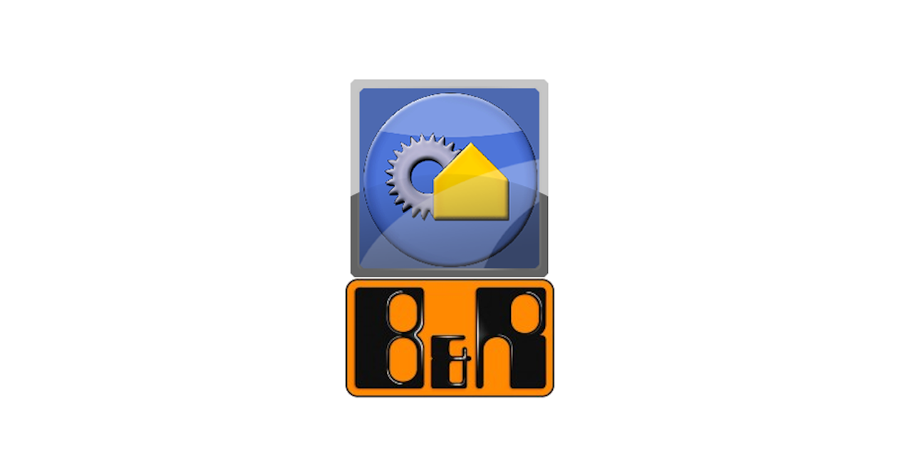

# brOscatLib

This repo is a port of the popular [Oscat lib](http://www.oscat.de) to the B&R Automation studio platform. The library contains all functions and function blocks that are in OscatBasic 3.34, Oscat building 1.00 and the Oscat network 1.35.2 library. At the moment, the libraries are a work in progress, the main programmatic porting has been going well. Depending on the ammount of contributers the library will be ported to completion. Initial port was done from Codesys plc open xml export.

## Table of Contents

- [Current status](#current-status)
- [Documentation](#documentation)
- [Installation](#installation)
- [Contributing](#contributing)
- [Support + Feedback](#support--feedback)
- [License](#license)

## Current status

Check detailed info [here](https://github.com/tkucic/brOscatLib/projects) in the projects tab.

Oscat Basic
- completed automated porting
- completed manual porting
- library compiles under AS 4.9
- TODO verification not done

Oscat Building
- completed automated porting
- TODO manual porting
- TODO library compiles under AS 4.9
- TODO verification not done

Oscat Network
- completed automated porting
- TODO manual porting
- TODO library compiles under AS 4.9
- TODO verification not done

## Documentation

Each POU has a link to its chapter in the related documentation. The documentation is available by clicking the link provided in the POUs declaration and at the top of the code implementation. For the automatic PDF navigation to work your browser must have Adobe Acrobat extension installed. Note: Some of the POUs do not navigate correctly as the Oscats official documentation hasn't updated the table of contents.

Links:
- [Oscat Basic](http://www.oscat.de/images/OSCATBasic/oscat_basic333_en.pdf)
- [Oscat Building](http://www.oscat.de/images/OSCATBuilding/oscat_building100_en.pdf)
- [Oscat Network](http://www.oscat.de/images/OSCATNetwork/oscat_netlib121_en.pdf)

### Quirks file

There is a [quirks file](quirks.md) file that should be updated every time a new "quirk" between CODESYS and Automation studio has been found.

## Installation

- Prerequisite B&R Automation studio SG4
- Add oscat libraries as references to a new project with "Add existing library" item from the toolbox

## Contributing

We appreciate feedback and contribution to this repo! Before you get started, please see the following:

- [contribution guidelines](CONTRIBUTING.md)
- [code of conduct guidelines](CODE-OF-CONDUCT.md)
- [This repo's contribution guide](CONTRIBUTING.md)

NOTE: At the moment I have no Automation Studio available as the funding for the project is non existant and Automation studio Evaluation license cannot be used for porting these libraries. If anyone wants to contribute they can use their own Automation studio with a commercial license or share the license with me.

## Support + Feedback

Include information on how to get support. Consider adding:

- Use [Issues](issues) for code-level support
- Use [Community]() for usage, questions, specific cases

## License

[brOScat LICENSE](LICENSE)

[Oscat LICENSE](OSCAT_LICENSE)
